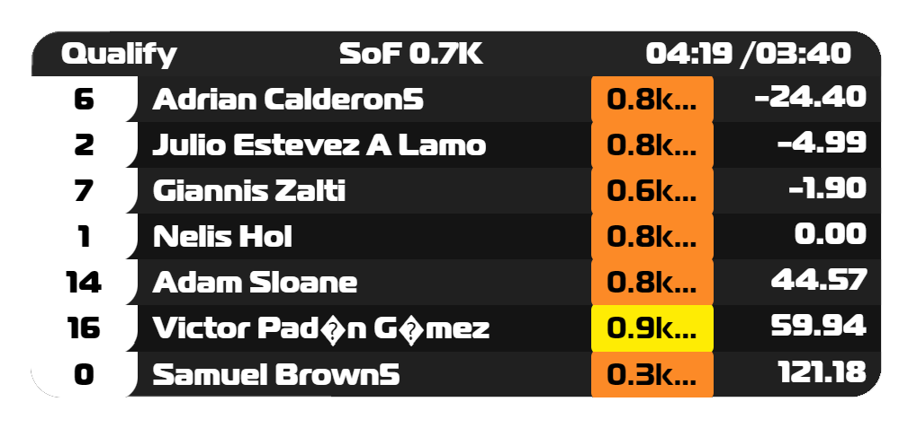
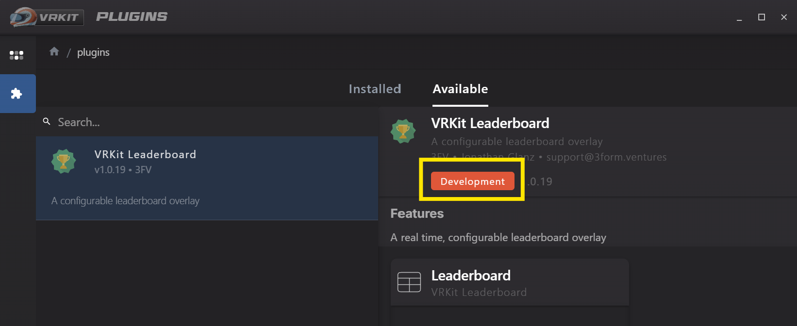

# VRKit Plugin Leaderboard

> ⚠️ **Warning:** This plugin is under-development and is
> only partially functional/accurate

A plugin for that visualizes leaderboards in iRacing.  
There are two modes, which currently can only be changed
in dashboard settings;  `standings` mode & `relative` mode.

## Installation

Got to the plugins section on the left navigation drawer 
in the main window.

Select the `Available` tab & select/search for the `Leaderboard` 
plugin. When you select it, you'll see an image similar to
the screenshot below.

> _NOTE: the button that says `Development` in the screenshot, will say `Install`._

Press `Install` & voila, the `Leaderboard` plugin will then be installed &
will be available when then `Add Overlay` button is pressed in the `Dashboard Editor`.
